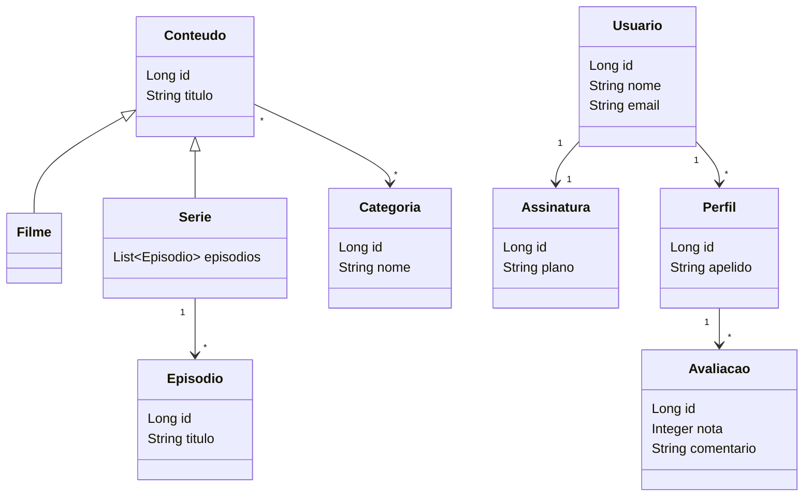
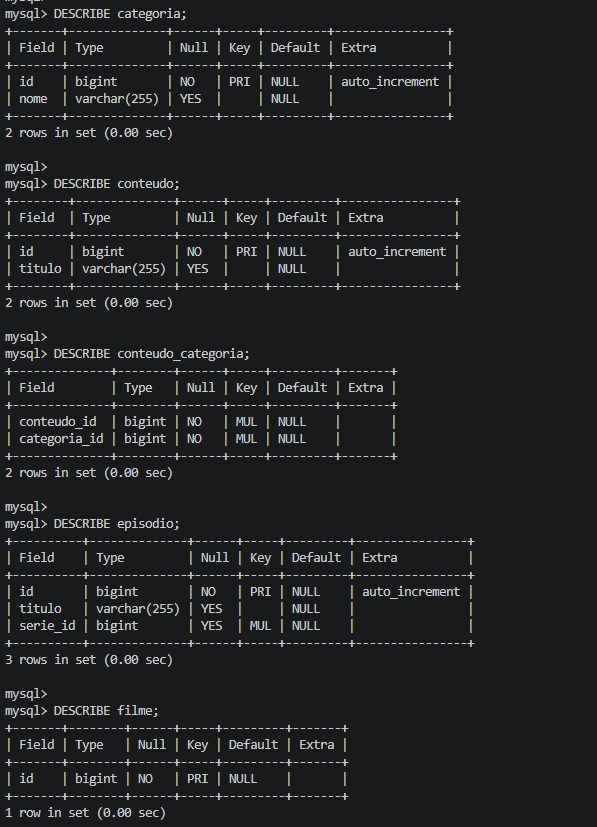
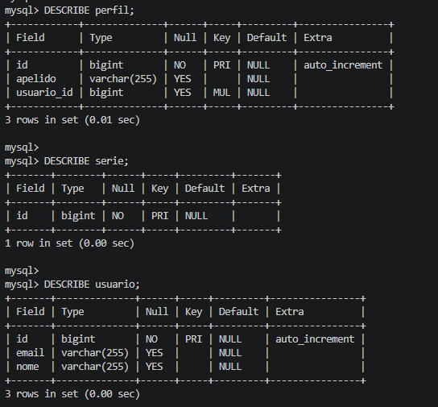

# Streaming API — Projeto Bimestral POO

## Integrantes
- Brayan Alves dos Santos
- Saulo Gabriel dos Sntos

## Tema
Sistema de Streaming

## Relacionamentos utilizados

| Relacionamento | Entre |
|---|---|
| 1:1 | Usuario → Assinatura |
| 1:N | Usuario → Perfil |
| 1:N | Serie → Episodio (bidirecional) |
| 1:N | Perfil → Avaliacao |
| N:M | Conteudo → Categoria |
| Herança | Conteudo ← Filme, Serie |

## Associação bidirecional
Entre `Serie` e `Episodio`:
- `Serie` tem `@OneToMany(mappedBy = "serie")`
- `Episodio` tem `@ManyToOne` com `@JoinColumn(name = "serie_id")`

## Estratégia de herança
`InheritanceType.JOINED` — cada classe vira sua própria tabela,
ligadas pelo `id`. `Filme` e `Serie` herdam `id` e `titulo` de `Conteudo`.

## Diagrama



## Banco de dados

Tabelas geradas automaticamente pelo Hibernate:




## Como rodar

### Pre-requisitos
- Java 21
- Docker Desktop instalado

### 1. Clone o repositório
```bash
git clone https://github.com/Brayan-Alves/poo-trabalho-2bi
cd poo-trabalho-2bi
```

### 2. Suba o banco com Docker
```bash
docker compose up -d
```

### 3. Rode o projeto
```bash
./mvnw spring-boot:run
```

O banco é criado automaticamente e os dados de teste são inseridos via `CommandLineRunner`.
